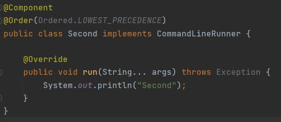
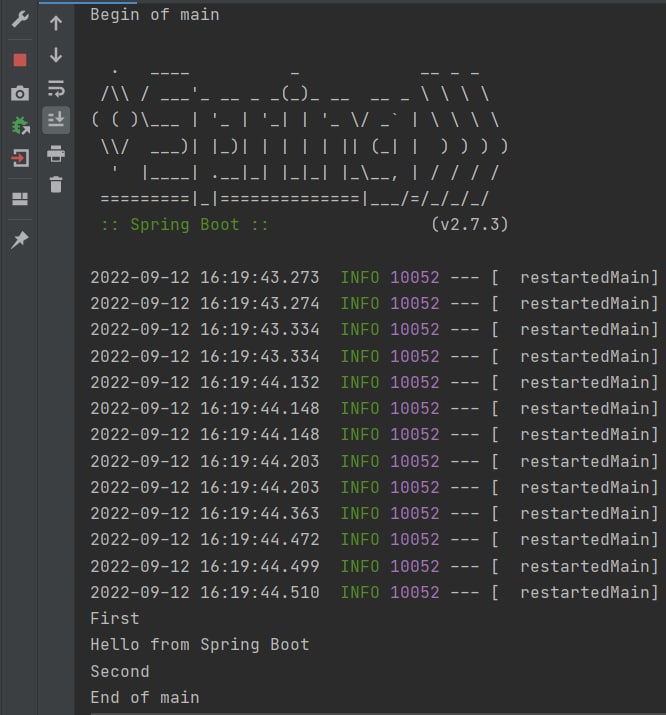
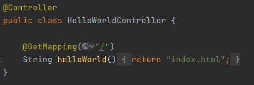
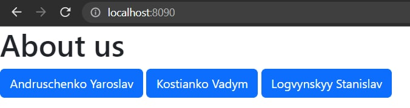

#Лабораторна робота №1

###**Тема:** Перше знайомство з Spring Framework  
###Завдання:
1. Встановіть JDK. При цьому зверніть увагу:  
   - версія JDK - не нижче ніж JDK8;
    - не переплутайте JDK (Java Development Kit) з JRE (Java Runtime Environment);
    - пропишіть у системі змінні PATH та JAVA_HOME.
2. Встановіть IDE:
    - Spring Tool Suit (Free, Open Source)
  https://spring.io/tools
    - IntelliJ IDEA Ultimate Edition (як студенти КПІ ви можете отримати безкоштовну ліцензію)
  https://www.jetbrains.com/student/
      
3. Створіть і запустіть консольний застосунок HelloWorld
    - Додайте до декларації класу інтерфейс CommandLineRunner та відповідний метод run(String... agrs).  
    
4. Використовуючи анотацію @Component додайте в перший проект два біна First та Second з інтерфейсом CommandLineRunner, які виводять на консоль слова "First" та "Second" відповідно. За допомогою анотації @Order зробіть так, щоб рядки на консоль виводились у наступному порядку:  
   

5. Створіть і запустіть веб-застосунок HelloWorld
    - Додайте контролер.
    
6. Додайте у другий проєкт кілька статичних HTML-сторінок про вашу команду в цілому та кожного з вас.
###Хід роботи:
1. Було створено Spring-додаток та додали до нього інтерфейс `CommandLineRunner`. Додали два додаткові біни First та Second, також реалізували у них інтерфейс `CommandLineRunner`. За допомогою анотації `@Order` зробили вивід рядків на консоль у заданому у завданні порядку
   - код:         
   - результат виконання   

   
2. Далі до поточного проекту додали контролер `HelloWorldController`, який при посиланні запиту на домашню сторінку застосунку посилає у відповідь файл `index.html`
    - 
    - 

    
###Висновок:
Ми дізналися, що таке Spring Framework, як створювати Spring-застосунок. Імплементували інтерфейс `CommandLineRunner` та дізналися в чому його пристосування та особливості.
На прикладі двох створених бінів First та Second вивчили та працювали з анотацією `@Order`, за допомгою якої можна налаштовувати виконання біна за чергою.
Також додали до проекту контролер `HelloWorldController`, за допомогою якого на домашню сторінку нашого застосунку виводиться інформація про членів нашої бригади.