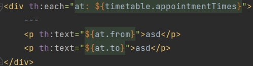
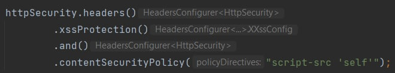

# Звіт до лабораторної роботи №2

## Тема: *Створення та зв’язування компонентів*  
## Завдання:
1. Отримайте у викладача номер варіанта для своєї бригади.
2. Створіть проект, який буде включати наступні модулі:
    - Spring Web;
    - Thymeleaf.
3. Компоненти рівня доступу до даних (@Repository) реалізуйте у вигляді заглушки (Stub або Fake). Повноцінна реалізація даного рівня передбачається у наступних лабораторних.
4. Рівень представлення реалізуйте у вигляді контролера (@Controller) та шаблонів (Thymeleaf) з мінімальною функціональністю, достатньою для демонстрації компонентів бізнес-логіки. Повноцінна реалізація даного рівня передбачається у наступних лабораторних.
5. На рівні сервісів (@Service) реалізуйте компоненти бізнес-логіки. При цьому в лабораторній роботі мають бути продемонстровані наступні можливості Spring Framework:
    - анотація @Component (@Repository, @Service, @Controller);
    - анотація @Bean;
    - створення бінів типу singleton та prototype;
    - ін’єкція залежностей через конструктор, сетер, та напряму у поле біна;

## Хід роботи:
1. Використовуючи проєкт з попередньої лабораторної роботи додаємо Maven-залежність для Thymeleaf.       Залежність для Spring Web вже була присутня з минулої ЛР.
2. Реалізовуємо наступні для рівня доступу до даних:      Вони реалізовані у вигляді заглушки, тобто замість реальної БД використовуються Java Collections. Наприклад,     
3. В нашому випадку реалізуємо один контролер з наступними точками зупинки:      На усі "ендпоінти" можна перейти.   На ендпоінті /search та /timetable/{id} можна дізнатися розклад шуканого доктора. 
4. Реалізуємо бізнес-логіку на рівні Service. Створюємо наступні класи:      У цих класах визначені необхідні методи для коректного пошуку та оброблення даних. Наприклад,      
5. Демонструємо наступні можливості Spring Framework:
   5.1. Анотація @Component (@Repository, @Service, @Controller);                 
   5.2. Анотація @Bean;      
   5.3. Cтворення бінів типу singleton та prototype;      
   5.4. Ін’єкція залежностей через конструктор, сетер, та напряму у поле біна;                 

## ВИСНОВКИ:
На цій лабораторній роботі ми навчились створювати та зв'язувати компоненти у Spring Framework. Cтворили рівень доступу до даних у вигляді заглушки. Реалізували компоненти бізнес-логіки. Налаштували кінцеві точки.